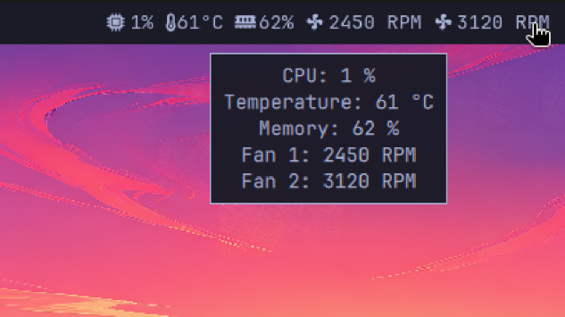

# Minimal Monitor

CPU load, temperature, memory and every fan on the machine — one compact
read-out each, straight in the [Omarchy](https://omarchy.org/) bar.

Click the widget for a panel listing every reading.



*Shown with sample temperature and fan values, so every metric is visible in one
shot. CPU and memory are live.*

## Why another system monitor

Most bar monitors either hide the fans behind a popup or only understand one
vendor's Super I/O chip. This one enumerates `/sys/class/hwmon` and shows every
fan it finds, on the bar itself, whatever the hardware is — each fan once, even
when two drivers report the same one.

## What it shows

The read-out adapts to the machine — nothing is hard-coded:

| Machine | Bar shows |
|---|---|
| Laptop with two fans | CPU, temperature, memory, both fans |
| Laptop with one fan | CPU, temperature, memory, one fan |
| Laptop whose fan two drivers report | CPU, temperature, memory, one fan |
| Fanless laptop | CPU, temperature, memory |
| No sensors at all | CPU, memory |

A fan that exists but is resting shows `0 RPM` rather than disappearing, so the
bar does not jump around every time it spins up. A fan that does not exist is
not drawn at all.

Temperature prefers the real CPU package sensor — `Tctl`/`Tdie` on AMD,
`Package id 0` on Intel — and falls back to the hottest readable sensor.

## Requirements

- Omarchy 4 (Quattro) with `omarchy-shell`
- `bash` — nothing else. No `lm_sensors`, no kernel modules, no vendor tools.

Readings come from `/proc/stat`, `/proc/meminfo` and `/sys/class/hwmon`, all
readable without privileges.

## Install

```bash
omarchy plugin add https://github.com/andreireanu/omarchy-minimal-monitor.git --enable
```

The widget mounts in the right bar section. Move it with:

```bash
omarchy bar move io.github.andreireanu.minimal-monitor --section center
```

Update later with:

```bash
omarchy plugin update io.github.andreireanu.minimal-monitor
```

## Remove

```bash
omarchy plugin disable io.github.andreireanu.minimal-monitor   # take it off the bar
omarchy plugin remove io.github.andreireanu.minimal-monitor    # delete it
```

## Use

- **Left click** — open the panel with every reading and its source chip
- **Right click** — toggle the `RPM` unit on and off to save bar space

## Development

The widget can be seen and tuned without Omarchy. `dev.qml` is a
Quickshell harness that draws the same bar read-out and panel rows in a plain
window, so it runs on any Wayland desktop:

```bash
quickshell -p dev.qml
```

The collector can also be run on its own:

```bash
./scripts/sysread                      # one reading
./scripts/sysread --loop --interval 2  # stream one reading every 2 seconds
```

Set `MONITOR_HWMON_ROOT` to a directory of fake `hwmon` nodes to test machines
you do not have — a fanless laptop, or a desktop with four fans:

```bash
MONITOR_HWMON_ROOT=/tmp/fake-hwmon ./scripts/sysread
```

`tests/fake-hwmon` does exactly that for eight shapes of hardware, including a
Framework laptop whose single fan is reported by two drivers at once:

```bash
./tests/fake-hwmon
```

It looks for the collector in this checkout, then in an installed plugin, so it
can also be run from a clone on a machine where the plugin is already set up.

## A note on reloading

Editing an installed plugin's QML is not picked up by `omarchy plugin
disable`/`enable`, nor by `omarchy-shell shell rescanPlugins` — both leave the
already-loaded QML in memory. Restart the shell instead:

```bash
omarchy-restart-shell
```

## License

MIT — see [LICENSE](LICENSE).
